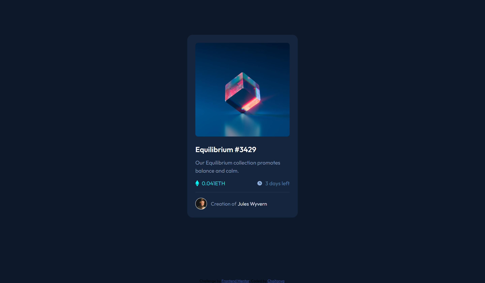

# Frontend Mentor - NFT preview card component



## Welcome! 👋

This is a solution to the NFT preview card component challenge on [Frontend Mentor](https://www.frontendmentor.io). Frontend Mentor challenges help you improve your coding skills by building realistic projects.

## Table of contents

- [Overview](#overview)
  - [The challenge](#the-challenge)
  - [Screenshot](#screenshot)
  - [Links](#links)
- [My process](#my-process)
  - [Built with](#built-with)
  - [What I learned](#what-i-learned)
  - [Continued development](#continued-development)
  - [Useful resources](#useful-resources)
- [Author](#author)
- [Acknowledgments](#acknowledgments)

## Overview

### The challenge

Users should be able to:

- View the optimal layout depending on their device's screen size
- See hover states for interactive elements

### Screenshot:

[my work](./images/_C__Users_chait_OneDrive_Documents_frontendMentor_nftPreviewCard_index.html.png)

### links

- [Solution URL](https://github.com/chaitanya71998/NFT-preview-card-component)
- [Live Site URL](https://chaitanya71998.github.io/NFT-preview-card-component/)

## My process

### Built with:

- I used VS code for development, Chrome to check output and github pages for deployment and version control. I used chrome dev tools to fix immediate ui checks and proper size fixes
- Coding languages:
  - HTML, CSS
- fonts
  - [Outfit](https://fonts.googleapis.com/css2?family=Outfit:wght@300;400;600&display=swap)

### What I Learned:

- This is a crazy assignment and bit challenging. I got to learn how to make cover an image with a color and element on hover.
- Another challenging part I faced is during output, with pixel perfect I managed to achieve output easily.
- Integrating existing local code to Git

  - git commands used

  ```sh
  git init
  git remote add origin <git repo link>
  git branch -M main
  git add -A
  git commit -m ""
  git push origin <branch name>
  ```

### Continued development

- I started with planning the design. I checked wether all the dependency images and colors are available.
- Found the colors and the font size are not clear in the design provided
- Used below references image color picker and pixel perfect to achieve color and layout.
- With the HTML code for Elements and CSS for styles closed this challenge.

### Resources

- for colors i used [imagecolorpicker.com](https://imagecolorpicker.com/en) this website and figured the colors on the image
- for mapping fonts and checking exact matching of my layout with ui given i used [pixel perfect](https://www.welldonecode.com/perfectpixel/)

## Author

- Frontend Mentor - [@chaitanya71998](https://www.frontendmentor.io/profile/chaitanya71998)
- Twitter - [@ChaitanyaTerli](https://twitter.com/ChaitanyaTerli)

## Acknowledgments

Thanks to [frontendmentor](https://www.frontendmentor.io/home)
